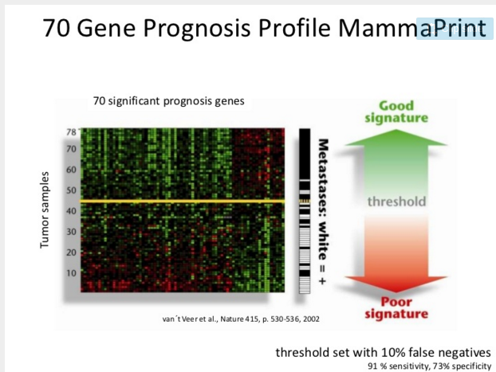
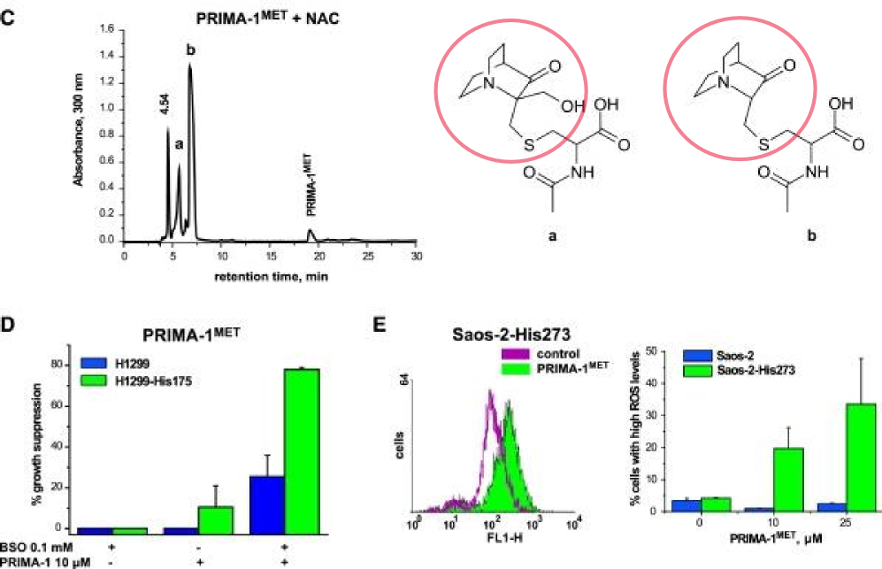
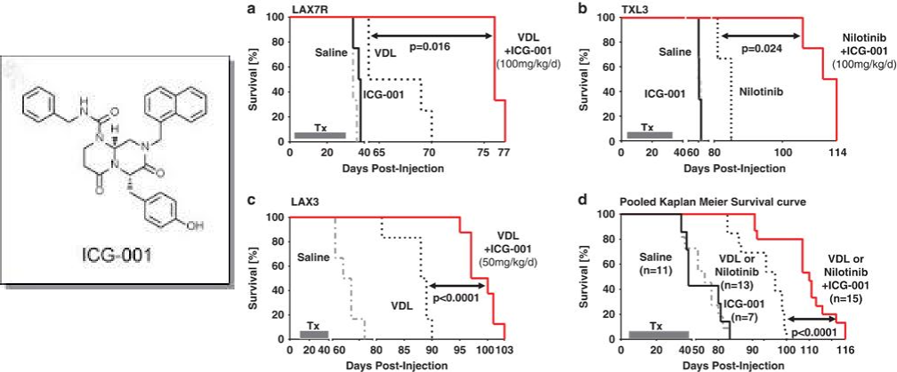

<!-- Limit image width and height -->

<!-- Center image on slide -->

<!-- Italic and Bold -->

--- .segue .dark .nobackground

## Recap

--- &twocol
## Vähi immuunokujundamine
# Vähirakkude ja immuunsüsteemi interaktsioon

***=left

- **Vähi täielik elimineerimine immuunsüsteemi poolt**
- **Immuunsüsteemi poolt kujundatud vähirakkude esiletõus**
- Immuunsüsteemiga kohandunud vähirakud on kas 
  - vähem immuunogeneesed,
  - suurenenud võimega inhibeerida vähivastast immuunvastust.

***=right

<footer class="source">Pilt: [neurosurgery-blog.com](http://www.neurosurgery-blog.com/archives/4770)
</footer>

----
# Vähi intsidents organ-transplantatsiooni patsientidel

|Site of cancer          | No. cases observed| No. cases expected| Ratio obs/exp (adj)|
|:-----------------------|------------------:|------------------:|-------------------:|
|non melanoma skin       |                127|                5.1|                21.7|
|thyroid other endocrine |                 30|                2.1|                11.0|
|mouth tongue lip        |                 22|                1.6|                10.0|
|cervix vulva vagina     |                 39|                3.6|                 9.4|
|non-Hodgkins lymphoma   |                 25|                2.4|                 8.5|
|kidney ureter           |                 32|                3.5|                 8.0|
|bladder                 |                 26|                4.7|                 5.2|
|colorectal              |                 38|               10.5|                 3.6|
|lung                    |                 30|               12.5|                 2.5|
|brain                   |                 10|                4.1|                 2.6|
|prostate                |                 11|                5.2|                 2.3|
|melanoma                |                  7|                4.1|                 2.0|
|breast                  |                 15|               13.6|                 1.2|

<footer class="source">Tabel: [Peto, J (2001)](http://www.nature.com/nature/journal/v411/n6835/full/411390a0.html). Cancer epidemiology in the last century and the next decade. Nature, 411, 6835:390-5.
[Birkeland, et al. (1995)](http://onlinelibrary.wiley.com/doi/10.1002/ijc.2910600209/abstract). Cancer risk after renal transplantation in the Nordic countries, 1964-1986. Int. J. Cancer, 60, 2:183-9. ADJustment by empirical Bayesian shrinkage towards a Beta prior.
</footer>

--- .segue .dark .nobackground

## Vähiravimid

---

## Vähitrendid 20. sajandil

 

<footer class="source">Andmed: Long-Term Trends in Cancer Mortality in the United States, 1930 –1998. Wingo et al., 
<a href="http://onlinelibrary.wiley.com/doi/10.1002/cncr.11380/pdf">2003</a>.
</footer>

---

## Kaks peamist trendi vähisuremuses
# Vähi suremus peegeldab ravi efektiivsust

- **Suremus osadesse kasvajatüüpidesse on vähenenud**. Tingituna näiteks mao- ja maksakasvajate puhul paremast toiduohutusest (*H. pylori*) ja emakakaela (ja soole-) kasvajate puhul sõeltestimistest.
- **Mitmed põhilised kasvajatüübid on jäänud resistentseks** enamuse kasutatavate ravimeetodite suhtes.
- Enamus laialt kasutatavatest vähiravimitest on kasutusele võetud juba enne 1970-ndaid aastaid, mil puudus arusaam vähi molekulaarsetest alustest.

---

## Esmased vähid ja 5 aasta suremus
# Käärid vähi diagnoosimise ja eduka ravi vahel

<footer class="source">Pilt: Cancer Research and the $90 Billion Metaphor. Eliot Marshall, 
<a href="http://www.sciencemag.org/content/331/6024/1540.1.full">2011</a>.
</footer>

----
## PSA sõeltestimise mõju metastaatilisele eesnäärmevähile

<footer class="source">Pilt: [PSA screening has also significantly impacted prostate cancer mortality](http://www.forbes.com/sites/benjamindavies/2015/11/15/the-governments-war-against-mens-health-its-about-to-get-worse/), the true measure of a successful screening test. In fact, prostate cancer has enjoyed the largest percent decline in mortality of any carcinoma in the past ten years!
</footer>

----

<footer class="source">Pilt: [PSA screening has also significantly impacted prostate cancer mortality](http://www.forbes.com/sites/benjamindavies/2015/11/15/the-governments-war-against-mens-health-its-about-to-get-worse/), the true measure of a successful screening test. In fact, prostate cancer has enjoyed the largest percent decline in mortality of any carcinoma in the past ten years!
</footer>

---&twocol

## Molekulaarne profileerimine aitab määrata rinnavähi ravi

<footer class="source">Pilt: L. van't Veer - [Genomic signatures of specific sites of metastases}(http://www.slideshare.net/ESOSLIDES/l-veer-abclisbonmetasites).
</footer>

---

## Molekulaarne profileerimine
# Difuusne suurerakuline lümfoom

<footer class="source">Pilt: The Biology of Human Lymphoid Malignancies Revealed by Gene Expression Profiling. Louis M. Staudt
& Sandeep Dave, 
<a href="http://www.ncbi.nlm.nih.gov/pmc/articles/PMC1351148/">2005</a>.
DLBCL, Diffuse Large B-Cell Lymphoma; PMBL, Primary Mediastinal B-Cell Lymphoma; GCB, Germinal Center B-Cell Lymphoma; ABC, Activated B-cell-like Lymphoma.
</footer>

---

## Biomarkerid
# Molekulaarne profileerimine annab ka infot selle kohta kas vähk on mingile kindlale märklaud ravile tundlik

- mitte-väikserakuline kopsuvähk, EGFR mutatsioonid määravad tundlikkuse türosiin kinaasi inhibiitoritele (iressa)
- GI strooma vähk, KIT ja PDGFRA mutatsioonid määravad tundlikkuse c-KIT ja PDGFR inhibiitoritele (imatinib)
- metastaatiline soolevähk, mutantne KRAS ennustab mitte-tundlikkuse anti-EGFR antikehadele.
- melanoom, BRAF mutatsioonid mutatsioonid määravad tundlikkuse spetsiifilistele inhibiitoritele (vemurafenib)
- rinnavähk, HER2 amplifikatsioon ennustab tundlikkust anti-HER2 teraapiale.

---

## Vähiravi strateegiad
# Surm/apoptoos vs diferentseerumine

- Enamus mittekirurgilise vähiravi strateegiatest põhineb sellel, et ravi tagajärjel **vähirakud lähevad apoptoosi**.
- Alternatiiviks on vähirakkude **diferentseeruma suunamine** nii, et nad muutuksid post-mitootilisteks.

<footer class="source">Pilt: 12-AAG (tanespimycin) indutseeritud mitoosikatastroof rinnavähi rakuliinidel. Zajac et al., 
<a href="http://mct.aacrjournals.org/content/7/8/2358.full">2008</a>.
</footer>

---

## Äge promüelotsüütne leukeemia

 - APL iseloomustab ebanormaalne mitte-küpsete granulotsüütide akumulatsioon ja on seotud retinoolhappe retseptori (RARα) translokatsiooniga (t(15;17)(q22;q12); PML-RAR).
    - Algselt fataalne haigus (kirjeldati 1957) on hästi ravitav **all-trans-retinoolhappega** mis diferentseerib need vähirakud neutrofiilideks.
    - all-trans-retinoolhape põhjustab diferentsatsiooni geene represseeriva PML-RAR valgu ubikvitineerimise ja proteasoomse lagundamise.

<footer class="source">Pildid: image.bloodline.net, wikipedia.
</footer>

---

## Ainult osa vähi valkudest sobivad ravimimärklauaks

- **Madalmolekulaarsed ühendid omavad peamiselt inhibeerivat toimet** valkudele millele nad seostuvad.
- Reeglina, tuumorsuppressorid ja genoomi korrashoiu eest vastutavad valgud ei sobi seega otseseks ravimi märklauaks: nende funktsiooni on vähirakkudes praktiliselt võimatu taastada.
- Onkogeenid ja neile signaalirajas järgnevad geenid on potentsiaalsed ravimimärklauad.

<footer class="source">Pilt: www.biooncology.com.
</footer>

---

## TP53 on siiski võimalik reaktiveerida

- **PRIMA-1** reageerib mutantse p53 tioolrühmadega ja moodustab kovalentse sideme. 
- PRIMA-modifitseeritud p53 omandab uuesti tuumorsupressor aktiivsuse põhjustab rakkude apoptoosi.

<footer class="source">Pilt: Lambert et al.,
<a href="http://www.sciencedirect.com/science/article/pii/S1535610809000786">2009
</a>.
</footer>

---

## TP53 reaktivatsioon

- **Nutlin-2**: Metsik tüüpi p53 assotseerub vähis tavaliselt MDM2 üle-ekspressiooniga. Sellistes kasvajates on võimalik blokeerida MDM2 seostumine p53 (Joonisel **b**).
- **PhiKan083**: p53 Y220C mutantset valku on ka võimalik reaktiveerida - PhiKan083 seostumine taastab p53 normaalse konformatsiooni (Joonisel **c,d**).

<footer class="source">Pilt: Brown et al.,
<a href="http://www.nature.com/nrc/journal/v9/n12/full/nrc2763.html">2009
</a>.
</footer>

---

## Onkogeen sõltuvus

- 'Onkogeen sõltuvus' ([*oncogene addiction*](http://carcin.oxfordjournals.org/content/21/5/857.abstract?ijkey=a8731bb91ca8497327c79918f8012a574b2a93b5&keytype2=tf_ipsecsha)): vaatamata tumorigeneesi käigus vähirakku akumuleerunud mitmete onkogeensetele mutatsioonidele, on vähirakk sõltuv kindla onkogeense valgu/raja aktivatsioonist.

---

## Onkogeen sõltuvus

- Kui see kriitiline onkogeenne rada 'kinni panna' siis vähk kollapseerub: 
    - BCR-ABL fuusionvalk kroonilises müelotsüütses leukeemias on tundlik imatinib-le,
    - HER2 on amplifitseerunud 25-30% rinnavähkides mis muudab need tundlikuks HER2-antikehadele (trastuzumab) ja inhibiitoritele (lapatinib),
    - EGFR 10-20% mitte-väikserakulised kopsuvähid sisaldavad aktiveerivaid mutatsioone kinaasses domäänis ja on tundlikud inhibiitoritele gefitinib ja erlotinib-ile,
    - BRAF V600E mutatsioon on 70% melanoomides, 40% kilpnäärmevähkides ja 20% mCRC mis muudab need tundlikuks nt. vemurafenib-ile.

<footer class="source">Pilt: B-raf ja vemurafenib kompleks. PDBid: <a href="http://www.pdb.org/pdb/explore/explore.do;jsessionid=145838DF509932768B590EB2463D199A?structureId=3OG7">3OG7</a>.
</footer>

---

# Eksperimentaalsed näited onkogeen sõltuvusest

Transgeenne onkogeen | vähi vastus
---------------------|------------
Vähi täielik regressioon peale transgeeni 'välja lülitamist' |
H-ras | melanoom kollapseerus
K-ras | kopsu adenokartsinoomi regressioon
bcr-abl | B-raku leukeemia regressioon
myc | T raku lümfoom, AML regressioon
fgf-7 | kopsu epiteeli hüperplaasia regressioon
SV40 LT | süljenäärme hüperplaasia regresseerus, kui transgeeni ekspresseeriti <4 kuud
Vähk jäi alles või relapseerus peale transgeeni 'välja lülitamist' |
SV40 LT | süljenäärme hüperplaasia tuli tagasi, kui transgeeni ekspresseeriti >4 kuud
neu | rinnanäärme adenokartsinoom relapseerus
myc või wnt | rinnanäärme adenokartsinoom jäi alles

---

## Vähiteraapias kasutatavad ravimiklassid

- Tsütotoksilised kemoterapeutikumid,
    - toimivad kiirelt jagunevatele rakkudele (nt. CHOP kombo:  Cyclophosphamide, Doxorubicin, Vincristine (Oncovin), Prednisolone).
- Hormoonravimid,
    - blokeerivad hormoon-sõltuvate vähirakkude jagunemist ja põhjustavad vähirakkude surma (Lutron, Zytiga), 
- Märklaud-ravimid,
    - inhibeerivad spetsiifilisi onkovalke, millest vähirakud on sõltuvad (*oncogene dependence*).

---

## Märklaud-ravimid

- Märklaud teraapias kasutatavad ravimid jagunevad kaheks peamiseks rühmaks
    - madalmolekulaarsed inhibiitorid
    - **monoklonaalsed antikehad** (*rituximab,bevacizumab,trastuzumab*,etc)
- Madalmolekulaarsed inhibiitorid jagunevad omakorda mitmeks rühmaks, millest osad on: 
    - **türosiin kinaasi inhibiitorid** (*imatinib mesylate,gefitinib,sorafenib, sunitinib*,etc), 
    - **seriin/treoniin kinaasi inhibiitorid** (*temsirolimus, everolimus,vemurafenib*,etc),
    - **proteasoomi inhibiitorid** (*bortezomib*).

- Näiteid [märklaud-ravimitest](http://www.mycancergenome.org/content/other/molecular-medicine/overview-of-targeted-therapies-for-cancer/)

--- &twocol

## Ravimimärklauaks sobivad valgud/*druggable targets*

***=left

- Valku loetakse sobivaks ravimi märklauaks kui ta omab identifitseeritavat **ensümaatilist aktiivsust** ja defineeritud  **katalüütiline sait** (*catalytic cleft*).
- Katalüütilisse lõhesse on võimalik seostada suhteliselt madalmolekulaarne (<1000Da) ühend. 
- Mitmed mittekovalentsed sidemed mis sellise madalmolekulaarse ühendi seostumisel moodustuvad, võimaldavad saavutada ravimi **kõrge spetsiifilisuse** ja **aviidsuse** (~mitmete kontaktide afiinsuste summa)  

***=right

<footer class="source">Pilt: BCR-ABL kompleksis imatinib-iga.
</footer>

---

## Ravimimärklauaks ebasobivad valgud
# Keskmiselt 1 valk 5 sobib

- Valke millel selge katalüütiline lõhe puudub peetakse üldiselt **ravimimärklauaks sobimatuks, nt. transkriptsioonifaktorid**. Onkovalgud MYC ja FOS klassifitseeruvad selliste valkuda hulka. Hormoonretseptorid on siin erand, sest neil on spetsiifiline hormooni siduv domään (tamoksifeen blokeerib östrogeeniretseptori)
- Teisalt ei garanteeri katalüütilise domääni olemasolu, et mingi valgu vastu on mõtet ravimit disainima hakata. Näiteks, 
    - RAS GTPaasne domään, mida pole mõtet inhibeerida, sest see omab juba isegi madalat RAS-i inhibeerivat toimet.
    - türosiin fosfataasid, mis toimivad signaaliraja negatiivses tagasisides.

---

## Valk-valk interaktsioonide blokeerimine

- **Nutlin-2**: blokeerib MDM2 seostumise metsik tüüpi p53.
- **ICG-001** blokeerib $\beta$-kateniini/CBP (*cyclic AMP response-element binding protein binding protein*) vahelise interaktsiooni.
    - CBP on Wnt/$\beta$-kateniini signaaliraja transkriptsiooni koaktivaator, mis koos $\beta$-kateniiniga aktiveerib mitmete oluliste anti-apoptootiliste geenide (survivin, IAP) ja ka tsükliin D1 ekspressiooni.

<footer class="source">Pilt: Small-molecule inhibition of CBP/catenin interactions eliminates drug-resistant clones in acute lymphoblastic leukemia. Gang et al.,
<a href="http://www.nature.com/onc/journal/v33/n17/fig_tab/onc2013169f7.html">2014</a>.
</footer>

---&twocol

## Kinaasid on vähiravis olulised ravimimärklauad
# Praegu, 24 terapeutilisest inhibiitorist kasutatakse 17 vähiravis

***=right

***=left

- Inimesel on genoomis 518 kinaasi geeni.
- ~395 kinaasi inhibiitorit ~110 erineva kinaasi vastu on kliinilises arenduses [de Castro, 2012](http://www.nature.com/clpt/journal/v93/n3/full/clpt2012237a.html).
- Türosiin kinaase on 90 ja seriin-treoniin kinaase 318.
- Kinaasne domään on erinevatel kinaasidel väga sarnane.

<footer class="source">Pilt: inimese kinoomi puu. Cell Signalling Technology, Inc.
</footer>

---

## EGFR inhibiitorid

Erinevate epidermaalse kasvufaktori retseptori (EGFR) türosiin kinaasi inhibiitorite seostumine kinaasse domääni ATP seostumise lõhesse. Moodustuvad mitmed mittekovalentsed sidemed.

 
 <footer class="source"> (a) Two-dimensional (2D) structure of reversible inhibitor gefitinib and the three-dimensional (3D) structure in complex with EGFR (PDB code 3UG2). (b) 2D structure of reversible inhibitor erlotinib and the 3D structure of the binding site of EGFR in complex with erlotinib (PDB code 4HJO). (c) 2D structure of the potent irreversible inhibitor afatinib (BIBW-2992) and the 3D structure of the binding site of EGFR in complex with afatinib, showing the covalent interaction with Cys797, highlighted in orange (PDB code 4G5J). PDB, Protein Data Bank. 
 Allikas: de Castro et al., 
<a href="http://www.ncbi.nlm.nih.gov/pmc/articles/PMC3577635/">2013</a>.
</footer>

---

## Ükski TKI pole absoluutselt selektiivne

 <footer class="source"> Pilt: Ringi suurus näitab inhibiitori sidumisafiinsust: suurem on kõrgema afiinsusega. Nature Immunology 10, 356 - 360 (2009).
</footer>

---

## Ravimiresistentsus

In vitro ravimiresistentsust vahendavad mutatsioonid BCR-ABL valgus

<footer class="source">Pilt: A partially overlapping network of BCR-ABL1 kinase domain mutations confer resistance to certain TKIs. O'Hare et al.,
<a href="http://www.nature.com/nrc/journal/v12/n8/fig_tab/nrc3317_F2.html">2012</a>.
</footer>

---

## Türosiin kinaasi inhibiitorite resistentsus kopsuvähis
# NSCLC resistentsusele viivad mehhanismid

<footer class="source"> Pilt: de Castro et al., 
<a href="http://www.nature.com/clpt/journal/v93/n3/full/clpt2012237a.html">2013</a>.
</footer>

---&twocol

## Kliinilised uuringud

***=left

- Faas 1 uuringud viiakse läbi tervetel vabatahtlikel (20-80) ja tehakse kindlaks ravimi ohutu doosi piirkond, uuritakse farmakokineetikat ja identifitseeritakse kõrvalmõjud.
- Faas 2 uuritakse 100-300 inimesel kas ravim on efektiivne võrreldes platseebo/standard raviga ja kõrvalmõjusid. Faasis 2a selgitatakse erinevate dooside toime. Faas 2b selgitab kas ravi(m) on efektiivne. Enamus ravimeid praagitakse välja 2. faasis.
- Faas 3 suured multikeskus (1000-3000) uuringud kinnitavad kliinilise efektiivsuse.

***=right

- **Terapeutiline aken**: ravimi doos mis asetseb efektiivsuse ja toksilisuse vahel.
- The therapeutic window is from 10% of therapeutic effect to 10% of the toxic effect

---

## TKI kõrvaltoime: EGFR inhibitsioon

- Erlotinibi kasutamisega võib patsentidel tekkida nahale aknesarnane lööve.
- Samas assotseerub sellise lööbe teke oluliselt parema ravitulemusega (mitte-väikserakuline kopsuvähk), olles nõnda ka farmakodünaamiliseks markeriks.

---

# 'Top 10 best-sellerit' vähiravimite hulgas 2013 (maailmas)

Bränd | näidustus | märklaud | tüüp | müük | firma
------| --------- |----------|------|----------------| ------
Rituxan | mitte-Hodgkini lümfoom, CLL | CD20 | antikeha |$7.78B | Roche 
Avastin | kolorektaal-, kopsu-, munasarja- ja ajuvähk | VEGF | antikeha | $6.75B | Roche
Herceptin| rinna-, mao- ja söögitoru vähk | HER2/neu | antikeha | $6.56B | Roche
Gleevec | leukeemia, GI vähk | BCR-ABL | väike kinaasi inhibiitor | $4.69B | Novartis
Alimta | kopsuvähk | puriini ja pürimidiini süntees | kemoterapeutikum | $2.7B | Eli Lilly 
Velcade |  multi müeloom | valkude lagundamine | proteasoomi inhibiitor | $2.6B | Takeda, J&J 
Erbitux | käärsoole ja pea-kaela vähk | EGFR |antikeha | $1.87B |  Merck, BMS 
Lupron | eesnäärme ja munasarja vähk | gonatotropiin | hormoonravim | $1.73B |AbbVie, Sanofi
Zytiga | eesnäärme vähk | androgeen | hormoonravim | $1.7B | J&J
Revlimid | multi müeloom, mantelrakk lümfoom | ? | kemoterapeutikum | $1.09B | Celgene

--- .segue .dark .nobackground

## Lingid teistele loengutele

--- &twocol 

***=left 

- [Sissejuhatav loeng](http://rpubs.com/tapa741/sissejuhatus)
- [Vähitüübid](http://rpubs.com/tapa741/vahityybid)
- [Onkoviirused](http://tpall.github.io/Onkoviirused)
- [Onkogeenid](http://tpall.github.io/Onkogeenid)
- [Retseptorid](http://tpall.github.io/Retseptorid)
- [Signaalirajad](http://tpall.github.io/Signaalirajad)
- [Tuumorsupressorgeenid](http://tpall.github.io/Tuumorsupressorid)
- [Rakutsüklikontroll](http://tpall.github.io/Rakutsyklikontroll)

***=right 

- [p53 ja apoptoos](http://tpall.github.io/p53-ja-apoptoos)
- [Immortalisatsioon](http://tpall.github.io/Immortalisatsioon)
- [Tumorigenees](http://tpall.github.io/Tumorigenees)
- [Genoomiterviklikkus](http://tpall.github.io/Genoomiterviklikkus)
- [Mikrokeskkond](http://tpall.github.io/Mikrokeskkond)
- [Metastaasid](http://tpall.github.io/Metastaas)
- [Immuunsus](http://tpall.github.io/Immuunsus)
- [Vähiravimid](http://tpall.github.io/Vahiravim)
