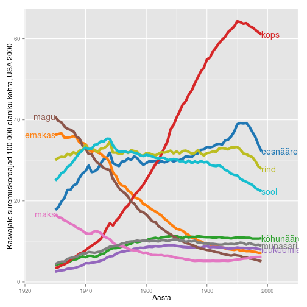
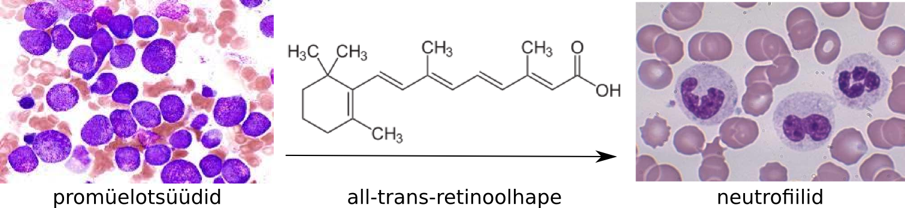

<!-- Limit image width and height -->

<!-- Center image on slide -->

<!-- Italic and Bold -->

--- .segue .dark .nobackground

## Recap

---

---&twocol

## Immunsüsteem ja vähk

--- .segue .dark .nobackground

## Vähiravimid

---

## Vähitrendid 20. sajandil

 

<footer class="source">Andmed: Long-Term Trends in Cancer Mortality in the United States, 1930 –1998. Wingo et al., 
<a href="http://onlinelibrary.wiley.com/doi/10.1002/cncr.11380/pdf">2003</a>.
</footer>

---

## Kaks peamist trendi vähisuremuses
# Vähi suremus peegeldab ravi efektiivsust

- **Suremus osadesse kasvajatüüpidesse on vähenenud**. Tingituna näiteks mao- ja maksakasvajate puhul paremast toiduohutusest (*H. pylori*) ja emakakaela (ja soole-) kasvajate puhul sõeltestimistest.
- **Mitmed põhilised kasvajatüübid on jäänud resistentseks** enamuse kasutatavate ravimeetodite suhtes.
- Enamus laialt kasutatavatest vähiravimitest on kasutusele võetud juba enne 1970-ndaid aastaid, mil puudus arusaam vähi molekulaarsetest alustest.

---

## Esmased vähid ja 5 aasta suremus
# Käärid vähi diagnoosimise ja eduka ravi vahel

<footer class="source">Pilt: Cancer Research and the $90 Billion Metaphor. Eliot Marshall, 
<a href="http://www.sciencemag.org/content/331/6024/1540.1.full">2011</a>.
</footer>

---&twocol

## Molekulaarne profileerimine aitab määrata ravi
# HER2/ER/PR-negatiivne rinnavähk

***=left

***=right

<footer class="source">Pildid: Molecular Stratification of Triple-Negative Breast Cancers. Charles M. Perou, 
<a href="http://theoncologist.alphamedpress.org/content/15/suppl_5/39.long">2010</a>.
</footer>

---

## Molekulaarne profileerimine
# Difuusne suurerakuline lümfoom

<footer class="source">Pilt: The Biology of Human Lymphoid Malignancies Revealed by Gene Expression Profiling. Louis M. Staudt
& Sandeep Dave, 
<a href="http://www.ncbi.nlm.nih.gov/pmc/articles/PMC1351148/">2005</a>.
</footer>

---

## Vähiravi strateegiad
# Surm/apoptoos vs diferentseerumine

- Enamus mittekirurgilise vähiravi strateegiatest põhineb sellel, et ravi tagajärjel **vähirakud lähevad apoptoosi**.
- Alternatiiviks on vähirakkude **diferentseeruma suunamine** nii, et nad muutuksid post-mitootilisteks.

<footer class="source">Pilt: 12-AAG (tanespimycin) indutseeritud mitoosikatastroof rinnavähi rakuliinidel. Zajac et al., 
<a href="http://mct.aacrjournals.org/content/7/8/2358.full">2008</a>.
</footer>

---

## Äge promüelotsüütne leukeemia

 - APL iseloomustab ebanormaalne mitte-küpsete granulotsüütide akumulatsioon ja on seotud retinoolhappe retseptori (RARα) translokatsiooniga (t(15;17)(q22;q12); PML-RAR).
    - Algselt fataalne haigus (kirjeldati 1957) on hästi ravitav **all-trans-retinoolhappega** mis diferentseerib need vähirakud neutrofiilideks.
    - all-trans-retinoolhape põhjustab diferentsatsiooni geene represseeriva PML-RAR valgu ubikvitineerimise ja proteasoomse lagundamise.

<footer class="source">Pildid: image.bloodline.net, wikipedia.
</footer>

---

## Ainult osa vähi valkudest sobivad ravimimärklauaks

- **Madalmolekulaarsed ühendid omavad peamiselt inhibeerivat toimet** valkudele millele nad seostuvad.
- Tuumorsuppressorid ja genoomi korrashoiu eest vastutavad valgud ei sobi seega ravimi märklauaks: nende funktsiooni on vähirakkudes praktiliselt võimatu taastada.
- Onkogeenid ja neile signaalirajas järgnevad geenid on potentsiaalsed ravimimärklauad.

---

## Vähiteraapias kasutatavad ravimiklassid

- Tsütotoksilised kemoterapeutikumid,
    - toimivad kiirelt jagunevatele rakkudele (nt. CHOP kombo:  Cyclophosphamide, Doxorubicin, Vincristine (Oncovin), Prednisolone).
- Hormoonravimid,
    - blokeerivad hormoon-sõltuvate vähirakkude jagunemist ja põhjustavad vähirakkude surma (Lutron, Zytiga), 
- Märklaud-ravimid,
    - inhibeerivad spetsiifilisi onkovalke, millest vähirakud on sõltuvad (*oncogene dependence*).

---

## Märklaud-ravimid

- Märklaud teraapias kasutatavad ravimid jagunevad kaheks peamiseks rühmaks
    - madalmolekulaarsed inhibiitorid
    - **monoklonaalsed antikehad** (*rituximab,bevacizumab,trastuzumab*,etc)
- Madalmolekulaarsed inhibiitorid jagunevad omakorda mitmeks rühmaks, millest osad on: 
    - **türosiin kinaasi inhibiitorid** (*imatinib mesylate,gefitinib,sorafenib, sunitinib*,etc), 
    - **seriin/treoniin kinaasi inhibiitorid** (*temsirolimus, everolimus,vemurafenib*,etc),
    - **proteasoomi inhibiitorid** (*bortezomib*).

- Näiteid [märklaudravimitest](http://www.mycancergenome.org/content/other/molecular-medicine/overview-of-targeted-therapies-for-cancer/)

---

## Kinaasi inhibiitorid vähiravis

A total of 24 small-molecule kinase inhibitors have
been approved for use as therapeutic agents, 17 of which are for
cancer. In addition, four monoclonal antibodies acting on protein
kinase targets have also been licensed for cancer therapy.

---

## EGFR inhibiitorid
# Chemical structures of epidermal growth factor receptor (EGFR) tyrosine kinase inhibitors and their molecular modes of binding to the target.

 
 <footer class="source"> (a) Two-dimensional (2D) structure of reversible inhibitor gefitinib and the three-dimensional (3D) structure in complex with EGFR (PDB code 3UG2). (b) 2D structure of reversible inhibitor erlotinib and the 3D structure of the binding site of EGFR in complex with erlotinib (PDB code 4HJO). (c) 2D structure of the potent irreversible inhibitor afatinib (BIBW-2992) and the 3D structure of the binding site of EGFR in complex with afatinib, showing the covalent interaction with Cys797, highlighted in orange (PDB code 4G5J). PDB, Protein Data Bank. 
 Allikas: de Castro et al., 
<a href="http://www.nature.com/clpt/journal/v93/n3/full/clpt2012237a.html">2013</a>.
</footer>

---

# 'Top 10 best-sellerit' vähiravimite hulgas 2013 (maailmas)

Bränd | näidustus | märklaud | tüüp | müük | firma
------| --------- |----------|------|----------------| ------
Rituxan | mitte-Hodgkini lümfoom, CLL | CD20 | antikeha |$7.78B | Roche 
Avastin | kolorektaal-, kopsu-, munasarja- ja ajuvähk | VEGF | antikeha | $6.75B | Roche
Herceptin| rinna-, mao- ja söögitoru vähk | HER2/neu | antikeha | $6.56B | Roche
Gleevec | leukeemia, GI vähk | BCR-ABL | väike kinaasi inhibiitor | $4.69B | Novartis
Alimta | kopsuvähk | puriini ja pürimidiini süntees | kemoterapeutikum | $2.7B | Eli Lilly 
Velcade |  multi müeloom | valkude lagundamine | proteasoomi inhibiitor | $2.6B | Takeda, J&J 
Erbitux | käärsoole ja pea-kaela vähk | EGFR |antikeha | $1.87B |  Merck, BMS 
Lupron | eesnäärme ja munasarja vähk | gonatotropiin | hormoonravim | $1.73B |AbbVie, Sanofi
Zytiga | eesnäärme vähk | androgeen | hormoonravim | $1.7B | J&J
Revlimid | multi müeloom, mantelrakk lümfoom | ? | kemoterapeutikum | $1.09B | Celgene

